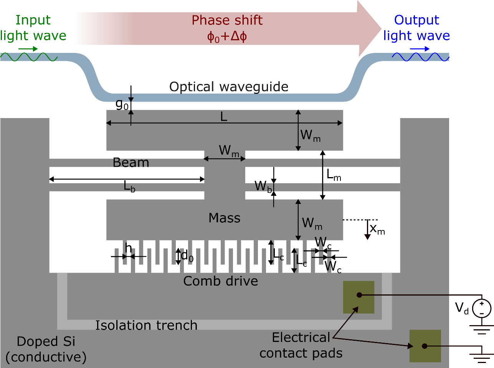
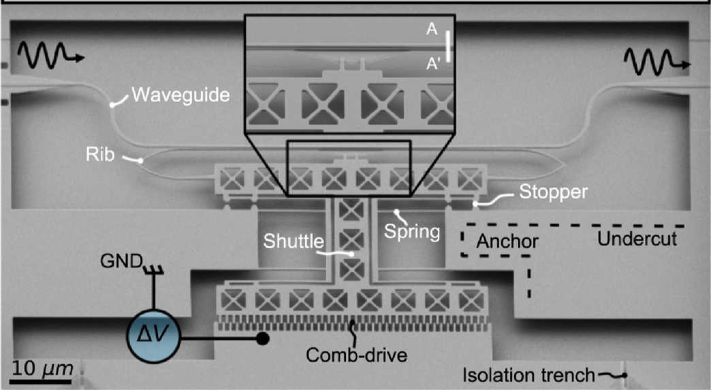
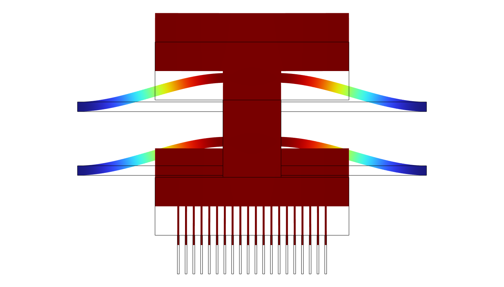
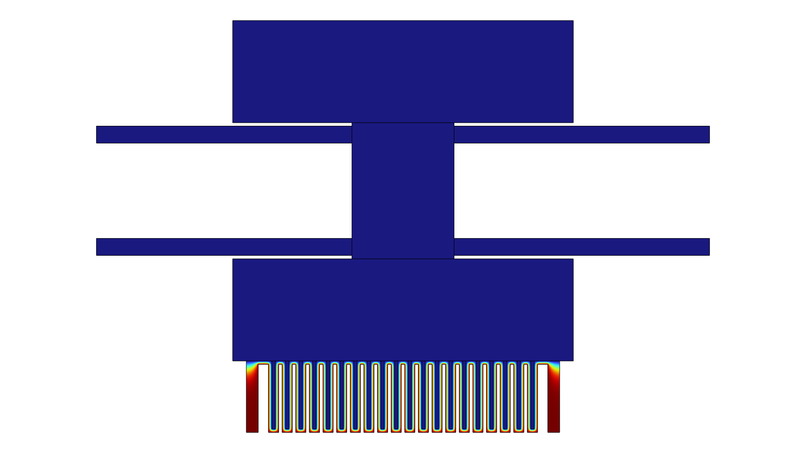
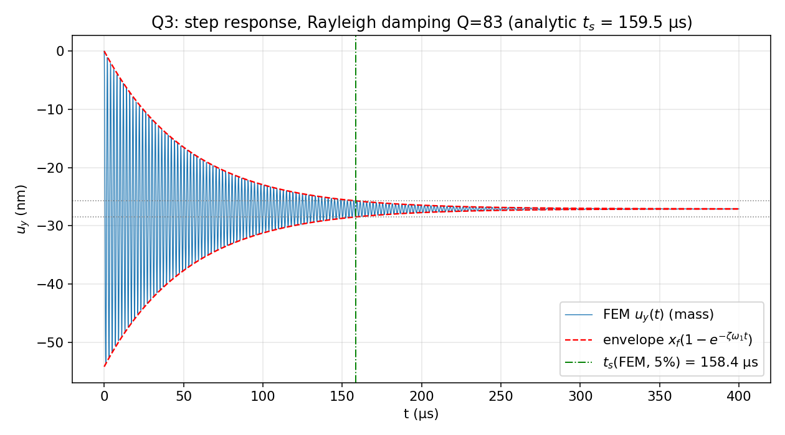
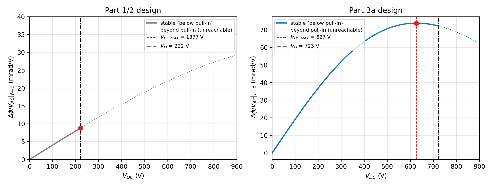
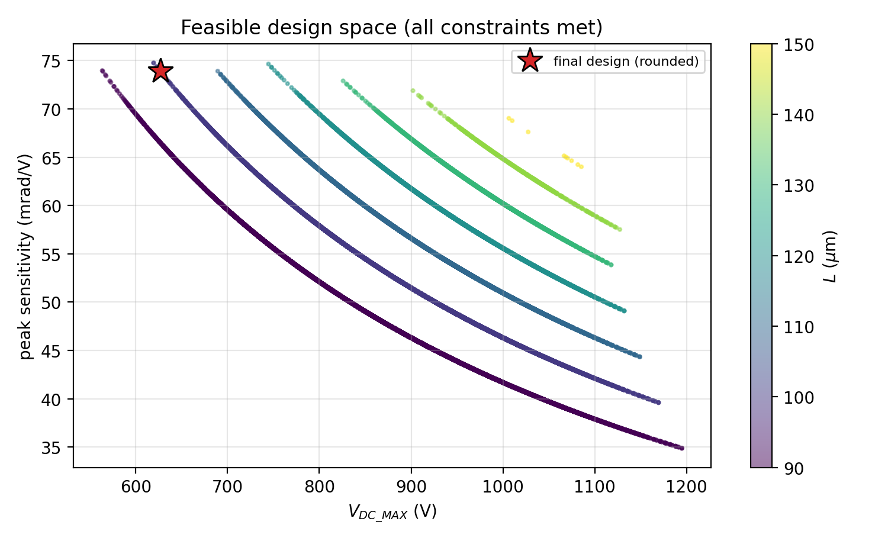
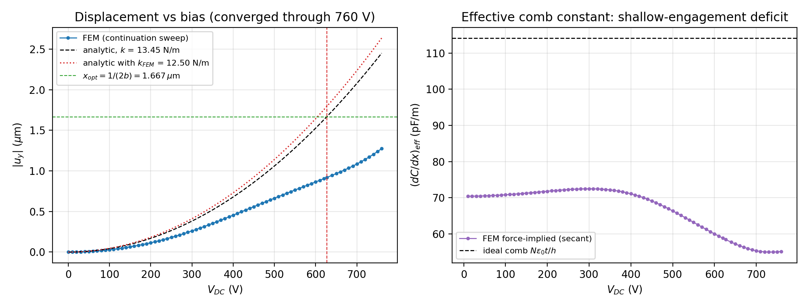
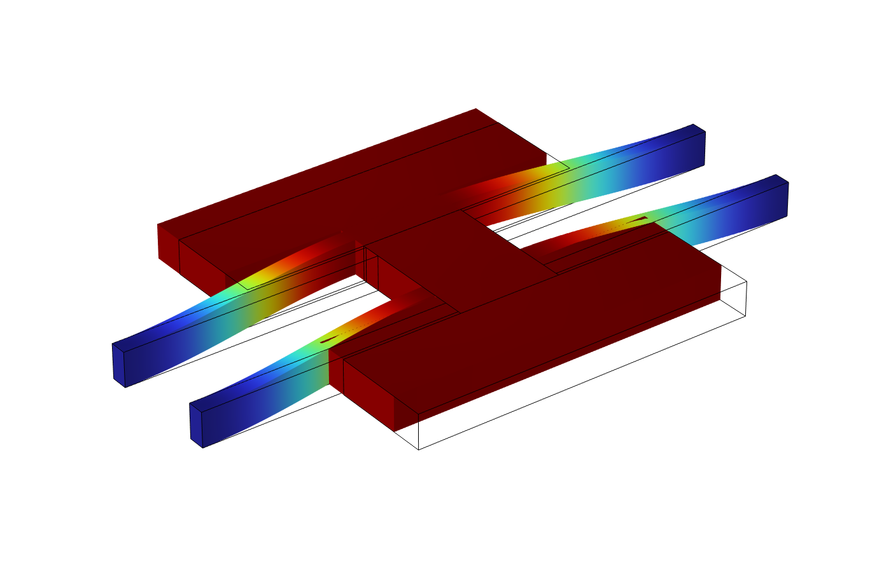

# MEMS Optical Phase Shifter — Design & Multiphysics Modelling

> Lumped-element analysis, 2D/3D finite-element simulation, and constrained design
> optimization of an electrostatic comb-drive MEMS optical phase shifter.
>
> Coursework for **ET4260 Microsystems Design & Modelling**, MSc Microelectronics, TU Delft.


<p align="center">
  
  
</p>
<p align="center"><em>Left: labelled model of the phase shifter (comb drive moves the modulation bar, changing the gap g₀ to the optical waveguide). Right: SEM of the real fabricated device.</em></p>

---

## What this is

A bias voltage V_d on the comb drive pulls a suspended silicon shuttle toward the
electrodes. The shuttle carries a **modulation bar** that sits a gap g₀ = 200 nm above
an optical waveguide. Moving the bar changes the waveguide's effective index, which
shifts the phase of the light passing through. The device is the actuator for an
integrated optical phase modulator (the kind used in photonic quantum circuits).

The work takes one device through three escalating modelling stages, each validating
the last:

| Part | Question | Method | Headline result |
|------|----------|--------|-----------------|
| **1 — Analytical** | What are the dynamics and limits? | Lumped spring-mass-damper, hand-derived, MATLAB | f₀ = 537 kHz, Q = 81, settling 145 µs, pull-in 347 V |
| **2 — 2D FEM** | Do the analytics hold in a continuum model? | COMSOL solid mechanics + electrostatics + moving mesh | k within 9% of theory; pull-in is a **side-instability at 224 V**, not the axial mode |
| **3a — Optimization** | What is the best stable design? | Closed-form objective + ~10⁶-point constrained grid search, FEM-validated | sensitivity **8.7 → 73.9 mrad/V (8.5×)** at a stable operating point |
| **3b — 3D** | Is the in-plane mode safe out of plane? | 3D FEM, thickness sweep | out-of-plane stiffness ratio characterised vs device thickness |

Everything in Parts 2 and 3 is **script-driven against COMSOL via the MPh Python API**,
so every number and figure regenerates end-to-end from source.

---

## Part 1 — Analytical lumped-element model

The shuttle is reduced to a single mass-spring-damper (mechanically equivalent to a
series RLC circuit). From the four fixed-guided suspension beams and the silicon
geometry:

- Stiffness  k = 4·E·t·W_b³ / L_b³ = **40.3 N/m**
- Effective mass (figure-faithful, counting both plates and the 20 moving fingers) = **3.54 pg**
- Resonance  f₀ = (1/2π)·√(k/m) = **537 kHz**
- Damping (squeeze-film + anchor loss) gives Q ≈ **81**, 5% settling ≈ **145 µs**
- Electrostatic finger-tip pull-in V_PI ≈ **347 V**

MATLAB scripts in [`assignment_p1/matlab/`](assignment_p1/matlab) reproduce every figure
(step response, max-acceleration shock limit, phase vs voltage, Bode, sensitivity).
Report: [`assignment_p1/report`](assignment_p1/report).

---

## Part 2 — 2D finite-element model (COMSOL)

A 2D plane-stress model (t = 200 nm SOI device layer) couples **Solid Mechanics**,
**Electrostatics**, **Electromechanical Forces**, and a hyperelastic **Moving Mesh** so
the air domain deforms with the shuttle.

<p align="center">
  
  
</p>
<p align="center"><em>Left: fundamental in-plane mode at 496 kHz (FEM) vs 537 kHz lumped. Right: electrostatic potential and field concentration in the comb at 50 V bias.</em></p>

<p align="center">
  
</p>
<p align="center"><em>Transient step response with Rayleigh damping: FEM settling 158 µs against the analytic 159 µs envelope — the continuum model confirms the lumped dynamics.</em></p>

Key findings:

- **Spring constant** k_FEM = 36.8 N/m, 8.7% softer than theory. The gap is real and
  explained: the analytical model assumes rigid plates and perfectly guided beam ends;
  the FEM lets the guided ends rotate with the compliant plates, and adds shear
  compliance. Re-solving with the plates made 1000× stiffer recovers the analytical
  value to 1%.
- **Pull-in is not the axial mode.** A prestressed-eigenvalue sweep shows a
  symmetry-breaking **rocking side-instability at 224 V**, well below the naive axial
  pull-in. Confirmed mesh-converged on a 51k-element re-run (223–225 V).
- **Five eigenmodes** mapped; transient damping reproduced (settling 158 µs).

Working notes and the full result/figure index: [`assignment_p2/ANSWERS.md`](assignment_p2/ANSWERS.md).
Geometry derivation: [`assignment_p2/comsol/GEOMETRY.md`](assignment_p2/comsol/GEOMETRY.md).

---

## Part 3a — Constrained design optimization

The phase sensitivity is the product of an electromechanical coupling that grows with
bias and an optical overlap that decays exponentially as the bias pushes the bar away.
That trade-off has a closed-form optimum:

```
                    ___________
V_DC_MAX  =  √( k·h / (b·N·ε₀·t) )         (bias for peak sensitivity)
```

with the neat corollary that the optimal displacement x = 1/(2b) ≈ 1.67 µm is a purely
optical quantity, independent of every mechanical dimension. Maximizing achievable
sensitivity then reduces to **minimizing V_DC_MAX while keeping it below pull-in** —
subject to a resonance floor (> 500 kHz), a shock-survival acceleration, side-stability
margins, internal-mode separation, comb packing, and the 200 nm technology window.

A ~10⁶-candidate grid search (~47k feasible designs) picks the operating point on the
sensitivity vs V_DC_MAX frontier.

<p align="center">
  
</p>
<p align="center"><em>The payoff. Old design (left) peaks <em>beyond</em> pull-in, so its best stable point is only ~8.7 mrad/V. The optimized design (right) places the sensitivity peak (73.9 mrad/V) safely below pull-in — an 8.5× gain at a stable operating point.</em></p>

<p align="center">
  
  
</p>
<p align="center"><em>Left: the feasible design space coloured by modulation length L; the star is the chosen design on the frontier. Right: FEM displacement-vs-bias continuation up to 760 V validating the optimized actuator.</em></p>

| Quantity | Part 1/2 | **Part 3a optimized** | Constraint |
|----------|----------|----------------------|------------|
| Stiffness k | 40.3 N/m | **13.5 N/m** | softened to the f_r floor |
| Resonance f_r | 518 kHz | **539 kHz** | > 500 kHz ✓ |
| Bias for peak V_DC_MAX | 1377 V | **627 V** | < V_PI ✓ |
| Pull-in (axial / side) | 347 / 222 V | 744 / **723 V** | > 200 V ✓ |
| Peak sensitivity \|H\| | 8.7 mrad/V | **73.9 mrad/V** | maximized |

Analytics and optimizer: [`assignment_p3/analysis/`](assignment_p3/analysis).
The new dimensions are then re-validated in COMSOL (spring constant, modes, x(V), accel,
pull-in). Details: [`assignment_p3/ANSWERS.md`](assignment_p3/ANSWERS.md).

---

## Part 3b — 3D out-of-plane analysis

A full 3D FEM checks that the in-plane working mode is not compromised out of plane, and
sweeps device-layer thickness to map the in-plane vs out-of-plane stiffness ratio.

<p align="center">
  
</p>
<p align="center"><em>3D fundamental mode (515 kHz): the four beams flex in plane while the shuttle translates, confirming the desired mode survives in 3D.</em></p>

---

## Supporting units

- **[`unit1-cross-domain-modeling/`](unit1-cross-domain-modeling)** — cross-domain
  (electrical ↔ mechanical ↔ thermal) lumped modelling in **LTspice**: an RLC reference,
  a mechanical analogue, and a thermal network, demonstrating the effort/flow analogy
  that underpins the Part 1 RLC equivalent.
- **[`assignment_unit4/`](assignment_unit4)** — homework on Hall sensors, temperature
  sensing, photodetectors, MOS devices, and a small FEM exercise (LaTeX report + MATLAB).

---

## Repository layout

```
.
├── assignment_p1/              Part 1 — analytical lumped model
│   ├── matlab/                 parameters + per-question plot scripts
│   └── report/                 LaTeX source, figures, compiled PDF
├── assignment_p2/              Part 2 — 2D FEM (COMSOL)
│   ├── comsol/scripts/         MPh build/solve scripts (ordered 01..10)
│   ├── comsol/models/          saved .mph models
│   ├── data/  figures/         exported CSVs + PNGs
│   ├── ANSWERS.md  GEOMETRY.md working answers + geometry derivation
│   └── report/
├── assignment_p3/              Part 3 — optimization + 3D
│   ├── analysis/               Python lumped model + optimizer
│   ├── comsol/                 FEM validation + 3D model
│   ├── data/  figures/         CSVs + PNGs
│   └── report/
├── assignment_unit4/           supporting homework (sensors/devices)
├── unit1-cross-domain-modeling/  LTspice cross-domain models
└── combined_report/            merged final PDF (Parts 1+2+3)
```

The single merged deliverable is
[`combined_report/5714699_Tyukov_ET4260_Final.pdf`](combined_report) (39 pages).

---

## Reproducing the results

**Analytics (no license needed):**

```bash
# Part 1 — MATLAB
cd assignment_p1/matlab && matlab -batch q_summary

# Part 3 — Python design + optimizer
cd assignment_p3/analysis
python p3a_model.py          # calibration checks
python p3a_optimize.py       # ~10^6-candidate grid search
python p3a_final_design.py   # freeze dimensions + figures
```

**FEM (COMSOL 6.4 + MPh, one license seat, run sequentially):**

```bash
cd assignment_p2/comsol/scripts
python 01_build_mech.py      # build mechanics model
python 02_q1_spring.py ...   # spring, modes, damping, electrostatics, pull-in
python 10_make_plots.py      # regenerate all figures from CSVs
```

Each `assignment_p*/README.md` documents its own script order and outputs.

---

## Skills demonstrated

- **Multiphysics FEM** — coupled solid mechanics + electrostatics + moving mesh in
  COMSOL; eigenfrequency, stationary, prestressed-eigenvalue, and transient studies.
- **First-principles modelling** — lumped spring-mass-damper derivation, squeeze-film
  damping, electrostatic pull-in, and the optical-coupling sensitivity model, all
  cross-checked against FEM.
- **Design optimization** — closed-form objective reduction plus a constrained grid
  search over a real technology window, with a quantified, validated improvement.
- **Reproducible engineering** — fully script-driven simulation (Python/MPh), exported
  CSVs feeding MATLAB/Python plotting, and version-controlled LaTeX reports.

---

*Daniel Tyukov · MSc Microelectronics, TU Delft · ET4260 (2026).*
